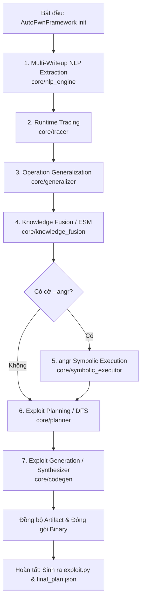

# Hoạt Động Của Hệ Thống (Activity Flow)

Tài liệu này mô tả luồng hoạt động (Activity Flow) chi tiết của hệ thống AutoPwn (v3.0) từ đầu đến cuối, dựa trên `RUNBOOK.md` và mã nguồn khởi chạy `autopwn.py`.

## 1. Khởi tạo (Initialization)

- **Framework creation**: `AutoPwnFramework` nhận đường dẫn binary mục tiêu, phân giải các thư mục output (`outputs/artifacts`, `outputs/traces`, `outputs/exploits`, `core/artifacts`).
- **Directory preparation**: Tạo tất cả các thư mục output nếu chưa tồn tại.

## 2. Luồng thực thi lõi (Core Pipeline)

Pipeline chính chạy tự động tuần tự qua các module sau (được điều phối bởi `framework.run()`):

1. **Multi-Writeup NLP Extraction (`core/nlp_engine`)**: 
   - Script: `extract_vars.py`
   - Nhiệm vụ: Phân tích các tài liệu writeup trong `data/writeups/`, trích xuất các biến quan trọng, primitive, bug và lưu thành `critical_vars.json`.
2. **Runtime Tracing (`core/tracer`)**:
   - Script: `runner.py --target <binary> [--angr]`
   - Nhiệm vụ: Chạy binary (với DynamoRIO theo mặc định, hoặc qua symbolic angr nếu có cờ `--angr`) để ghi nhận các sự kiện thao tác bộ nhớ heap ở runtime và xuất ra `trace_events.json`.
3. **Operation Generalization (`core/generalizer`)**:
   - Script: `operation_generalizer.py`
   - Nhiệm vụ: Chuyển đổi các sự kiện trace thô thành các thao tác tượng trưng (symbolic operations) mang tính tổng quát hóa, lưu vào `generalized_actions.json`.
4. **Knowledge Fusion / Composite ESM (`core/knowledge_fusion`)**:
   - Script: `esm.py`
   - Nhiệm vụ: Kết hợp các biến NLP, hành động tổng quát hóa và tri thức ngoài để xây dựng Cỗ máy Trạng thái Khai thác (Exploitation State Machine - ESM), kết quả là `esm_output.json`.
5. **angr Symbolic Execution (`core/symbolic_executor`)** *(Chỉ chạy khi có cờ `--angr`)*:
   - Script: `angr_executor.py --binary <binary>`
   - Nhiệm vụ: Khám phá các đường dẫn bằng symbolic execution, hỗ trợ giải quyết ràng buộc (constraint solving), lưu kết quả vào `symbolic_results.json`.
6. **Exploit Planning (Evolutionary DFS) (`core/planner`)**:
   - Script: `planner.py --binary <binary>`
   - Nhiệm vụ: Sử dụng ESM để lập kế hoạch chuỗi các hành động tạo thành mã khai thác cuối cùng, xuất ra cấu trúc kế hoạch `final_plan.json`.
7. **Exploit Generation / Synthesizer (`core/codegen`)**:
   - Script: `synthesizer.py --binary <binary> [--solve <solve.py>] [--libc <libc.so>]`
   - Nhiệm vụ: Tổng hợp `final_plan.json` thành một đoạn script khai thác bằng Python sử dụng pwntools, xuất ra `exploit.py`.

## 3. Đồng bộ và Đóng gói kết quả (Post-Processing & Packaging)

- **Artifact Synchronisation**: Copy tất cả JSON artifact nội bộ từ `core/artifacts/` sang thư mục người dùng `outputs/artifacts/`.
- **Trace Log**: Nếu có raw trace log (ví dụ: `/tmp/autopwn_trace.log`), chuyển sang `outputs/traces/raw_trace.log`.
- **Packaging**: Sao chép binary mục tiêu, các thư viện phụ thuộc như `libc.so.6` (nếu có) vào thư mục `outputs/exploits/` để script exploit có thể chạy độc lập.

---

## 4. Sơ đồ luồng hoạt động (Mermaid Flowchart)

