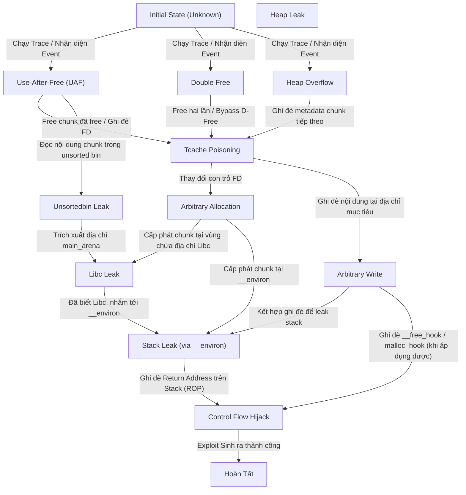

# State Machine: Exploitation State Machine (ESM)

Tài liệu này mô tả chi tiết Cỗ máy Trạng thái Khai thác (Exploitation State Machine - ESM) được sử dụng trong hệ thống AutoPwn (được định nghĩa chủ yếu trong `core/knowledge_fusion/esm.py` và `core/planner/planner.py`).

## 1. Định nghĩa Trạng thái (State Definition)

Trong AutoPwn, một trạng thái khai thác (`ESMState`) tại bất kỳ thời điểm nào được định nghĩa bởi một tập hợp các tri thức đã khám phá được (detected) hoặc chưa biết (unknown). Các thành phần cấu tạo nên một trạng thái bao gồm:

- **Bugs (Lỗi phần mềm)**: `double_free`, `uaf`, `overflow`, v.v.
- **Primitives (Nguyên thủy khai thác)**: `arbitrary_allocation`, `arbitrary_write`, `arbitrary_free`, v.v.
- **Techniques (Kỹ thuật khai thác)**: `tcache_poisoning`, `unsortedbin_leak`, `chunk_overlap`, v.v.
- **Capabilities (Năng lực đạt được)**: `libc_leak`, `heap_leak`, `stack_leak`, v.v.
- **Goals (Mục tiêu cuối cùng)**: `control_flow_hijack`, `shell`, v.v.
- **Latent Capabilities (Năng lực tiềm ẩn)**: Các năng lực có thể đạt được từ trạng thái hiện tại (ví dụ: có `libc_leak` và `arbitrary_write` có thể dẫn đến `stack_leak` hoặc `control_flow_hijack`).

Một sự thay đổi trạng thái (State Transition) xảy ra khi một **Action** được áp dụng thành công lên một trạng thái $S_i$, tạo ra một trạng thái mới $S_{i+1}$ bổ sung thêm các Primitives, Capabilities hoặc Goals mới.

## 2. Quá trình chuyển đổi (State Transitions)

Thuật toán Quy hoạch Tiến hóa (Evolutionary Planner - DFS) trong `planner.py` sẽ thực hiện Action Query (AQ) để tìm các hành động (Action) có thể áp dụng dựa trên trạng thái hiện tại (nếu các điều kiện `from` được thỏa mãn). 

Một luồng trạng thái khai thác tiêu biểu đi từ lúc bắt đầu cho đến khi đạt được mục tiêu như sau:

1. **Initial State (Trạng thái ban đầu)**: Chưa có thông tin gì (`unknown`).
2. **Bug Detection**: Thông qua trace event, hệ thống phát hiện lỗi (vd: `double_free`, `uaf`).
3. **Technique/Primitive Acquisition**: Áp dụng kỹ thuật (vd: `tcache_poisoning`) để thu được primitive (vd: `arbitrary_write`, `arbitrary_allocation`).
4. **Capability Escalation**: Lợi dụng primitive để leak thông tin (vd: `libc_leak`, sau đó là `stack_leak`).
5. **Goal Achievement**: Đạt được mục tiêu kiểm soát luồng thực thi (`control_flow_hijack`).

---

## 3. Biểu đồ State Machine (ESM Transition Diagram)

Biểu đồ Mermaid dưới đây mô tả sự chuyển đổi trạng thái ở mức trừu tượng hóa (từ Initial State đến Goal) qua các nút thắt (Bugs $\rightarrow$ Techniques/Primitives $\rightarrow$ Capabilities $\rightarrow$ Goals).

### 3.1. Diễn giải các luồng chuyển đổi chính
- **Libc Leak Pathway**: Phát hiện `uaf` $\rightarrow$ Áp dụng `unsortedbin_leak` $\rightarrow$ Trạng thái cập nhật thêm `libc_leak`.
- **Arbitrary Write Pathway**: Phát hiện `double_free` $\rightarrow$ Áp dụng `tcache_poisoning` $\rightarrow$ Trạng thái cập nhật thêm `arbitrary_write` và `arbitrary_allocation`.
- **Stack Leak Pathway**: Đã có `libc_leak` (biết địa chỉ `__environ`) và `arbitrary_allocation` $\rightarrow$ Tạo chunk tại `__environ` để read $\rightarrow$ Trạng thái cập nhật thêm `stack_leak`.
- **Goal Pathway**: Có `stack_leak` và `arbitrary_allocation` $\rightarrow$ Tạo chunk tại return address của stack $\rightarrow$ Đạt được `control_flow_hijack` qua ROP.
