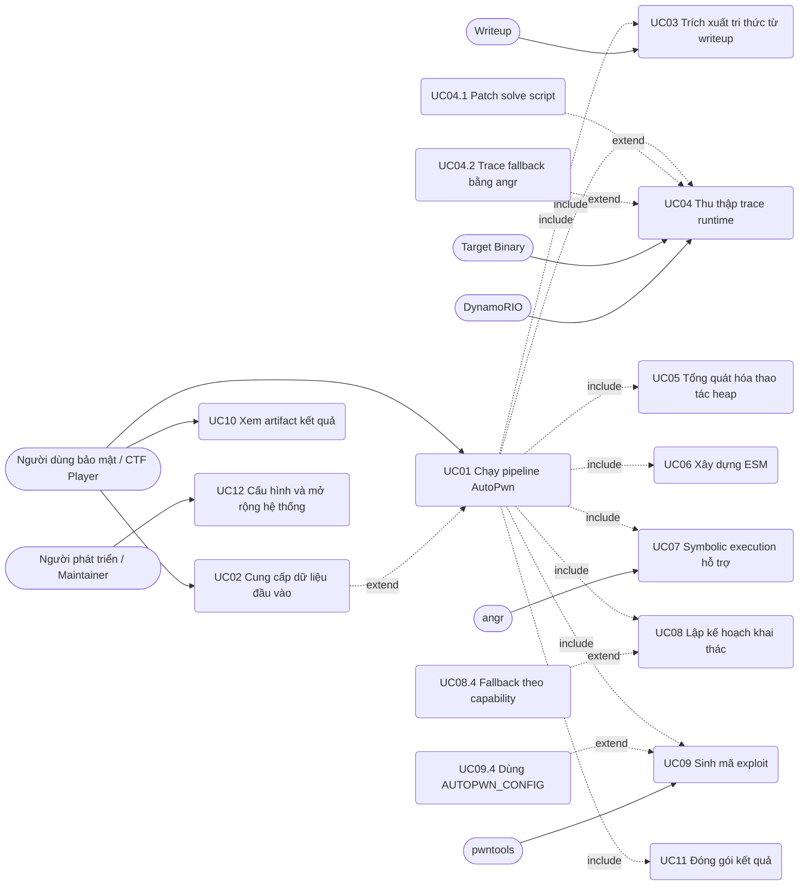
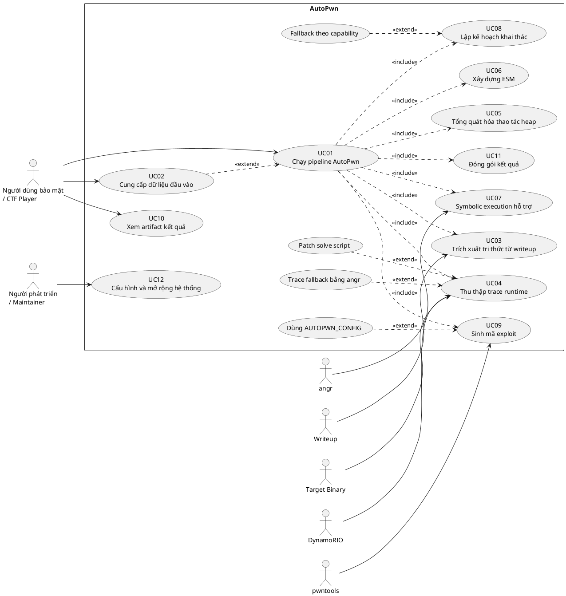

# Phân Tích Actor Và Use Case Hệ Thống AutoPwn

Tài liệu này phân tích các actor, use case chính và quan hệ `include`/`extend` của hệ thống AutoPwn dựa trên source code hiện tại. Mục tiêu là phục vụ phần đặc tả yêu cầu và thiết kế use case trong báo cáo đồ án CNTT.

## 1. Tổng quan hệ thống dưới góc nhìn use case

AutoPwn là hệ thống hỗ trợ người dùng tự động hóa một phần quy trình phân tích và sinh mã khai thác lỗi heap cho các bài CTF PWN. Người dùng cung cấp binary mục tiêu và các artifact hỗ trợ như writeup, solve script, libc; hệ thống thực hiện pipeline gồm trích xuất tri thức, trace runtime, tổng quát hóa thao tác, xây dựng trạng thái khai thác, lập kế hoạch và sinh exploit.

Use case tổng quát nhất của hệ thống là:

```text
Người dùng bảo mật / CTF Player
        |
        v
Chạy AutoPwn trên binary mục tiêu
        |
        +-- Trích xuất tri thức từ writeup
        +-- Thu thập trace runtime
        +-- Tổng quát hóa thao tác heap
        +-- Xây dựng ESM
        +-- Symbolic execution hỗ trợ
        +-- Lập kế hoạch exploit
        +-- Sinh exploit.py
        +-- Xuất artifact kết quả
```

---

## 2. Các actor của hệ thống

### 2.1. Actor chính

| Actor | Mô tả | Vai trò với hệ thống |
|---|---|---|
| Người dùng bảo mật / CTF Player | Người trực tiếp sử dụng AutoPwn để phân tích bài PWN. | Cung cấp binary, chạy pipeline, xem artifact và thử exploit sinh ra. |
| Người phát triển / Maintainer | Người bảo trì source code AutoPwn. | Cấu hình module, mở rộng rule NLP, chỉnh planner, cập nhật codegen. |

### 2.2. Actor phụ / hệ thống ngoài

| Actor phụ | Mô tả | Vai trò |
|---|---|---|
| Target Binary | Chương trình CTF PWN cần khai thác. | Đối tượng được trace, phân tích và sinh exploit. |
| Writeup / Tài liệu lời giải | Tài liệu mô tả kỹ thuật khai thác. | Nguồn tri thức đầu vào cho module NLP. |
| solve.py mẫu | Script khai thác có sẵn hoặc script tương tác mẫu. | Được dùng để lấy interface thao tác menu và hỗ trợ runtime tracing. |
| DynamoRIO | Framework instrumentation động. | Chạy binary dưới tracer để ghi nhận thao tác heap. |
| angr | Framework symbolic execution. | Phân tích binary, tìm call site heap/I/O và hỗ trợ concretize symbolic action. |
| pwntools | Thư viện Python hỗ trợ exploit. | Được dùng để load ELF/libc, tìm ROP gadget và sinh script exploit. |
| Hệ điều hành / File System | Môi trường chạy lệnh và lưu file. | Lưu artifact JSON, trace log, exploit output, binary và thư viện. |

### 2.3. Nhận xét về actor

Trong mô hình use case UML, actor chính nên đặt là **Người dùng bảo mật / CTF Player**, vì đây là đối tượng khởi tạo các use case nghiệp vụ. Các thành phần như DynamoRIO, angr, pwntools, binary và filesystem là actor phụ hoặc hệ thống ngoài vì chúng tương tác với AutoPwn nhưng không đại diện cho người dùng cuối.

---

## 3. Danh sách use case chính

| Mã UC | Use case | Actor chính | Mô tả ngắn | Input | Output |
|---|---|---|---|---|---|
| UC01 | Chạy pipeline AutoPwn | Người dùng bảo mật / CTF Player | Khởi chạy toàn bộ pipeline tự động từ binary đến exploit. | Đường dẫn binary, tùy chọn `--angr`. | Bộ artifact và `exploit.py`. |
| UC02 | Cung cấp dữ liệu đầu vào | Người dùng bảo mật / CTF Player | Chuẩn bị binary, writeup, solve script, libc/loader nếu có. | Binary, writeup, `solve.py`, `libc.so.6`. | Dữ liệu sẵn sàng cho pipeline. |
| UC03 | Trích xuất tri thức từ writeup | Người dùng bảo mật / CTF Player | Phân tích writeup để lấy bug, primitive, target, technique. | Writeup/text. | `critical_vars.json`. |
| UC04 | Thu thập trace runtime | Người dùng bảo mật / CTF Player | Chạy binary để ghi nhận thao tác heap. | Binary, solve script, DynamoRIO hoặc angr. | `trace_events.json`, raw trace log. |
| UC05 | Tổng quát hóa thao tác heap | Hệ thống AutoPwn | Chuyển event cụ thể thành symbolic action. | `trace_events.json`, `critical_vars.json`. | `generalized_actions.json`. |
| UC06 | Xây dựng Exploitation State Machine | Hệ thống AutoPwn | Suy luận bug, primitive, capability theo timeline event. | `critical_vars.json`, `trace_events.json`. | `esm_output.json`. |
| UC07 | Thực hiện symbolic execution hỗ trợ | Hệ thống AutoPwn | Load binary bằng angr, tìm heap call site và hỗ trợ concretize. | Binary, ESM, generalized actions. | `symbolic_results.json`. |
| UC08 | Lập kế hoạch khai thác | Hệ thống AutoPwn | Dùng ESM và exploit IR để sinh chuỗi stage khai thác. | ESM, critical vars, symbolic results, binary. | `final_plan.json`. |
| UC09 | Sinh mã exploit | Người dùng bảo mật / CTF Player | Compile final plan thành script pwntools. | `final_plan.json`, binary, solve script, libc. | `outputs/exploits/exploit.py`. |
| UC10 | Xem artifact kết quả | Người dùng bảo mật / CTF Player | Kiểm tra các file JSON, trace log và exploit được sinh ra. | Thư mục `outputs/`. | Thông tin phân tích và exploit script. |
| UC11 | Đóng gói kết quả | Hệ thống AutoPwn | Copy artifact, binary và thư viện vào `outputs/`. | Internal artifacts, binary, libc/loader. | Bộ output có thể xem/chạy lại. |
| UC12 | Cấu hình và mở rộng hệ thống | Người phát triển / Maintainer | Cập nhật taxonomy, rule NLP, planner, synthesizer. | Source code/config. | Hệ thống được mở rộng chức năng. |

---

## 4. Đặc tả các use case chính

### UC01. Chạy pipeline AutoPwn

**Actor chính:** Người dùng bảo mật / CTF Player  
**File liên quan:** `autopwn.py`

**Mục tiêu:** tự động chạy toàn bộ pipeline phân tích và sinh exploit.

**Tiền điều kiện:**

- Binary mục tiêu tồn tại.
- Môi trường Python có các dependency cần thiết.
- Nếu dùng tracing động, môi trường cần có DynamoRIO.
- Nếu dùng symbolic mode, cần có angr.

**Luồng chính:**

1. Người dùng chạy lệnh `python autopwn.py <binary>`.
2. Hệ thống kiểm tra binary có tồn tại hay không.
3. Hệ thống tạo các thư mục output.
4. Hệ thống chạy lần lượt các module con:
   - NLP Extraction.
   - Runtime Tracing.
   - Operation Generalization.
   - Knowledge Fusion / ESM.
   - Symbolic Execution.
   - Exploit Planning.
   - Code Generation.
5. Hệ thống copy artifact sang `outputs/artifacts/`.
6. Hệ thống copy binary/thư viện sang `outputs/exploits/`.
7. Hệ thống thông báo đường dẫn exploit được sinh ra.

**Input:**

- Binary target.
- Option `--angr` nếu muốn dùng symbolic tracing.

**Output:**

- `outputs/artifacts/*.json`
- `outputs/traces/raw_trace.log`
- `outputs/exploits/exploit.py`

**Quan hệ:**

- `include` UC03, UC04, UC05, UC06, UC07, UC08, UC09, UC11.
- `extend` UC02 nếu người dùng cung cấp thêm `solve.py` hoặc libc.

---

### UC02. Cung cấp dữ liệu đầu vào

**Actor chính:** Người dùng bảo mật / CTF Player

**Mục tiêu:** chuẩn bị đầy đủ artifact đầu vào để tăng độ chính xác của pipeline.

**Luồng chính:**

1. Người dùng đặt binary mục tiêu vào workspace hoặc benchmark.
2. Người dùng cung cấp writeup nếu có.
3. Người dùng cung cấp `solve.py` nếu có.
4. Người dùng cung cấp `libc.so.6` hoặc loader nếu binary cần môi trường riêng.

**Input:**

- Binary.
- Writeup.
- solve script.
- libc/loader.

**Output:**

- Bộ input được các module AutoPwn sử dụng.

**Quan hệ:**

- `extend` UC01 vì pipeline vẫn có thể chạy khi thiếu một số artifact, nhưng kết quả có thể kém chính xác hơn.
- `extend` UC04 nếu `solve.py` được dùng để trace hành vi thực tế.
- `extend` UC09 nếu `solve.py` được dùng để trích xuất interface.

---

### UC03. Trích xuất tri thức từ writeup

**Actor chính:** Người dùng bảo mật / CTF Player  
**Actor phụ:** Writeup / tài liệu lời giải  
**File liên quan:** `core/nlp_engine/extract_vars.py`

**Mục tiêu:** chuyển văn bản writeup thành tri thức có cấu trúc.

**Luồng chính:**

1. Hệ thống đọc dữ liệu writeup.
2. Hệ thống tách code token và phần prose.
3. Hệ thống chuẩn hóa thuật ngữ exploit.
4. Hệ thống phân loại thuật ngữ vào taxonomy.
5. Hệ thống xây dựng critical variables và exploit IR.
6. Hệ thống lưu kết quả ra JSON.

**Input:**

- Nội dung writeup hoặc text mô tả exploit.

**Output:**

- `core/artifacts/critical_vars.json`

**Quan hệ:**

- `include` trong UC01.
- `include` UC03.1 Chuẩn hóa thuật ngữ.
- `include` UC03.2 Phân loại tri thức.

#### UC03.1. Chuẩn hóa thuật ngữ

**Mô tả:** ánh xạ các cụm như `free hook`, `malloc hook`, `heap address`, `tcache poisoning` về tên chuẩn như `__free_hook`, `__malloc_hook`, `heap_base`, `tcache_poisoning`.

**Quan hệ:**

- `include` bởi UC03.

#### UC03.2. Phân loại tri thức

**Mô tả:** gom thuật ngữ vào các nhóm `bugs`, `primitives`, `hooks`, `functions`, `leak_targets`, `structures`, `techniques`, `capabilities`.

**Quan hệ:**

- `include` bởi UC03.

---

### UC04. Thu thập trace runtime

**Actor chính:** Người dùng bảo mật / CTF Player  
**Actor phụ:** Target Binary, DynamoRIO, angr, solve.py  
**File liên quan:** `core/tracer/runner.py`, `core/tracer/heap_tracer.c`

**Mục tiêu:** ghi nhận các thao tác heap/runtime của binary mục tiêu.

**Luồng chính với DynamoRIO:**

1. Hệ thống build `libheap_tracer.so`.
2. Hệ thống tạo wrapper chạy binary dưới `drrun`.
3. Nếu có `solve.py`, hệ thống patch script để chạy qua wrapper.
4. Hệ thống chạy binary/solve script.
5. Tracer ghi raw log.
6. Hệ thống parse raw log thành JSON event.

**Luồng thay thế với angr:**

1. Người dùng chạy pipeline với option `--angr`.
2. Hệ thống load binary bằng angr.
3. Hệ thống tìm symbol `malloc`/`free`.
4. Hệ thống mô phỏng một số event heap.
5. Hệ thống xuất event JSON.

**Input:**

- Binary target.
- solve script nếu có.
- DynamoRIO hoặc angr.

**Output:**

- `/tmp/autopwn_trace.log`
- `core/artifacts/trace_events.json`

**Quan hệ:**

- `include` trong UC01.
- `extend` UC04.1 Patch solve script nếu có `solve.py`.
- `extend` UC04.2 Trace bằng angr nếu người dùng chọn `--angr` hoặc không dùng DynamoRIO.

#### UC04.1. Patch solve script để chạy tracing

**Mô tả:** tự động sửa `solve.py` để thay `exe.process()` hoặc `process(_path)` bằng process chạy wrapper DynamoRIO, đồng thời thay `p.interactive()` bằng `p.close()`.

**Quan hệ:**

- `extend` UC04, chỉ xảy ra khi tồn tại `solve.py`.

#### UC04.2. Trace fallback bằng angr

**Mô tả:** dùng angr để tạo event khi không có trace động đầy đủ.

**Quan hệ:**

- `extend` UC04, xảy ra khi chọn chế độ `--angr`.

---

### UC05. Tổng quát hóa thao tác heap

**Actor chính:** Hệ thống AutoPwn  
**File liên quan:** `core/generalizer/operation_generalizer.py`

**Mục tiêu:** chuyển trace event cụ thể thành action symbolic có thể tái sử dụng.

**Luồng chính:**

1. Hệ thống đọc `trace_events.json`.
2. Hệ thống ước lượng heap base từ allocation đầu tiên.
3. Hệ thống tìm chunk chứa từng địa chỉ thao tác.
4. Hệ thống gán vai trò symbolic cho object.
5. Hệ thống chuyển size cụ thể thành khoảng symbolic theo heap bin.
6. Hệ thống ghi `generalized_actions.json`.

**Input:**

- `trace_events.json`
- `critical_vars.json`

**Output:**

- `generalized_actions.json`

**Quan hệ:**

- `include` trong UC01.
- `include` UC05.1 Phân loại heap bin.
- `include` UC05.2 Gán symbolic object.

#### UC05.1. Phân loại heap bin

**Mô tả:** phân loại chunk size thành `fastbin`, `tcache`, `smallbin`, `largebin`.

**Quan hệ:**

- `include` bởi UC05.

#### UC05.2. Gán symbolic object

**Mô tả:** gán địa chỉ/chunk thành `leak_obj`, `victim_obj`, `placeholder_obj`.

**Quan hệ:**

- `include` bởi UC05.

---

### UC06. Xây dựng Exploitation State Machine

**Actor chính:** Hệ thống AutoPwn  
**File liên quan:** `core/knowledge_fusion/esm.py`

**Mục tiêu:** mô hình hóa tiến trình khai thác thành chuỗi trạng thái có evidence.

**Luồng chính:**

1. Hệ thống đọc critical variables và trace event.
2. Hệ thống cập nhật bảng chunk khi gặp `Alloc`/`Free`.
3. Hệ thống phát hiện bug heap khi có event bất thường.
4. Hệ thống phát hiện primitive/capability từ event và note.
5. Hệ thống gắn evidence cho từng phát hiện.
6. Hệ thống suy luận latent capability.
7. Hệ thống lưu timeline trạng thái ESM.

**Input:**

- `critical_vars.json`
- `trace_events.json`

**Output:**

- `esm_output.json`

**Quan hệ:**

- `include` trong UC01.
- `include` UC06.1 Phát hiện bug heap.
- `include` UC06.2 Gắn evidence.
- `include` UC06.3 Suy luận latent capability.

#### UC06.1. Phát hiện bug heap

**Mô tả:** nhận diện `double_free`, `uaf`, `overflow`, `arbitrary_free` từ event và trạng thái chunk.

**Quan hệ:**

- `include` bởi UC06.

#### UC06.2. Gắn evidence

**Mô tả:** lưu lại event chứng minh cho từng bug, primitive, technique, capability hoặc goal.

**Quan hệ:**

- `include` bởi UC06.

#### UC06.3. Suy luận latent capability

**Mô tả:** dự đoán khả năng tiềm ẩn như `stack_leak`, `control_flow_hijack` dựa trên primitive đã phát hiện.

**Quan hệ:**

- `include` bởi UC06.

---

### UC07. Thực hiện symbolic execution hỗ trợ

**Actor chính:** Hệ thống AutoPwn  
**Actor phụ:** angr, Target Binary  
**File liên quan:** `core/symbolic_executor/angr_executor.py`

**Mục tiêu:** phân tích binary bằng angr để bổ sung thông tin cho quá trình lập kế hoạch.

**Luồng chính:**

1. Hệ thống load binary bằng angr.
2. Hệ thống tìm call site của `malloc`, `free`, `read`, `write`, `recv`, `send`, ...
3. Hệ thống đánh dấu cặp alloc/free có khả năng liên quan.
4. Hệ thống sắp xếp operation theo DOF, DOC và pairing.
5. Hệ thống duyệt generalized action.
6. Hệ thống ghi symbolic results.

**Input:**

- Binary target.
- `esm_output.json`.
- `generalized_actions.json`.

**Output:**

- `symbolic_results.json`.

**Quan hệ:**

- `include` trong UC01.
- `include` UC07.1 Tìm heap call site.
- `include` UC07.2 Concretize symbolic value.

#### UC07.1. Tìm heap call site

**Mô tả:** tìm các symbol liên quan heap/I/O trong binary.

**Quan hệ:**

- `include` bởi UC07.

#### UC07.2. Concretize symbolic value

**Mô tả:** chuyển symbolic value/size thành giá trị cụ thể theo rule heuristic.

**Quan hệ:**

- `include` bởi UC07.

---

### UC08. Lập kế hoạch khai thác

**Actor chính:** Hệ thống AutoPwn  
**File liên quan:** `core/planner/planner.py`

**Mục tiêu:** tạo kế hoạch khai thác từ trạng thái ESM và tri thức đã trích xuất.

**Luồng chính:**

1. Hệ thống đọc `esm_output.json`.
2. Hệ thống đọc `critical_vars.json`.
3. Hệ thống đọc `symbolic_results.json` nếu có.
4. Hệ thống lấy trạng thái ban đầu từ ESM.
5. Hệ thống truy vấn action khả thi.
6. Hệ thống áp dụng DFS để tìm đường tới goal.
7. Nếu DFS không tìm được đường đầy đủ, hệ thống fallback theo capability đã phát hiện.
8. Hệ thống sinh các stage IR.
9. Hệ thống lưu final plan.

**Input:**

- `esm_output.json`
- `critical_vars.json`
- `symbolic_results.json`
- Binary target/libc nếu có.

**Output:**

- `final_plan.json`

**Quan hệ:**

- `include` trong UC01.
- `include` UC08.1 Truy vấn action.
- `include` UC08.2 DFS tìm exploit path.
- `include` UC08.3 Sinh exploit IR.
- `extend` UC08.4 Fallback theo capability nếu DFS thất bại.

#### UC08.1. Truy vấn action

**Mô tả:** lấy action từ exploit IR nếu điều kiện `from` đã được phát hiện trong trạng thái hiện tại.

**Quan hệ:**

- `include` bởi UC08.

#### UC08.2. DFS tìm exploit path

**Mô tả:** duyệt trạng thái, áp dụng action, so sánh state equivalence và backtrack nếu không đạt goal.

**Quan hệ:**

- `include` bởi UC08.

#### UC08.3. Sinh exploit IR

**Mô tả:** chuyển action sequence thành stage IR như `setup_and_libc_leak`, `target_environ_leak`, `modern_rop_on_stack`.

**Quan hệ:**

- `include` bởi UC08.

#### UC08.4. Fallback theo capability

**Mô tả:** nếu DFS không tìm được path hoàn chỉnh, planner vẫn sinh IR dựa trên capability đã phát hiện.

**Quan hệ:**

- `extend` UC08, xảy ra khi DFS thất bại.

---

### UC09. Sinh mã exploit

**Actor chính:** Người dùng bảo mật / CTF Player  
**Actor phụ:** pwntools, solve.py, libc  
**File liên quan:** `core/codegen/synthesizer.py`

**Mục tiêu:** tạo script exploit Python có thể chạy bằng pwntools.

**Luồng chính:**

1. Hệ thống đọc `final_plan.json`.
2. Hệ thống đọc symbolic results và critical vars nếu có.
3. Hệ thống parse `AUTOPWN_CONFIG` từ `solve.py` nếu có.
4. Hệ thống trích xuất interface `create`, `delete`, `view`, `edit` từ `solve.py` nếu có.
5. Hệ thống quản lý index chunk theo tag.
6. Hệ thống resolve libc expression và tìm ROP gadget.
7. Hệ thống compile từng IR instruction thành code pwntools.
8. Hệ thống lưu `exploit.py`.

**Input:**

- `final_plan.json`
- Binary name.
- `solve.py` tùy chọn.
- libc tùy chọn.
- `symbolic_results.json`, `critical_vars.json`.

**Output:**

- `outputs/exploits/exploit.py`

**Quan hệ:**

- `include` trong UC01.
- `include` UC09.1 Trích xuất interface.
- `include` UC09.2 Quản lý index chunk.
- `include` UC09.3 Tìm ROP gadget.
- `extend` UC09.4 Dùng cấu hình từ `AUTOPWN_CONFIG` nếu có.

#### UC09.1. Trích xuất interface từ solve script

**Mô tả:** lấy các hàm thao tác menu như `create`, `delete`, `view`, `edit`, `free`, `read_data` để tái sử dụng trong exploit sinh ra.

**Quan hệ:**

- `include` bởi UC09 khi có solve script; nếu không có thì dùng interface mặc định.

#### UC09.2. Quản lý index chunk

**Mô tả:** cấp phát index theo tag chunk, đánh dấu index đã free và tái sử dụng nếu cấu hình cho phép.

**Quan hệ:**

- `include` bởi UC09.

#### UC09.3. Tìm ROP gadget

**Mô tả:** dùng pwntools ROP hoặc byte search để tìm `pop rdi; ret` và `ret` trong libc.

**Quan hệ:**

- `include` bởi UC09 nếu exploit cần ROP.

#### UC09.4. Dùng cấu hình từ AUTOPWN_CONFIG

**Mô tả:** đọc `index_base`, `reuse_index`, `needs_size`, prompt và menu choice từ solve script.

**Quan hệ:**

- `extend` UC09, xảy ra khi solve script có cấu hình `AUTOPWN_CONFIG`.

---

### UC10. Xem artifact kết quả

**Actor chính:** Người dùng bảo mật / CTF Player

**Mục tiêu:** kiểm tra các kết quả trung gian/cuối cùng để đánh giá pipeline.

**Luồng chính:**

1. Người dùng mở thư mục `outputs/artifacts/`.
2. Người dùng xem các file JSON trung gian.
3. Người dùng kiểm tra trace log nếu cần debug.
4. Người dùng mở `outputs/exploits/exploit.py`.
5. Người dùng chỉnh sửa hoặc chạy thử exploit nếu cần.

**Input:**

- Các file trong `outputs/`.

**Output:**

- Nhận định của người dùng về kết quả sinh exploit.

**Quan hệ:**

- `extend` UC01, thường xảy ra sau khi pipeline hoàn tất.

---

### UC11. Đóng gói kết quả

**Actor chính:** Hệ thống AutoPwn  
**File liên quan:** `autopwn.py`

**Mục tiêu:** gom các file kết quả vào thư mục output dễ sử dụng.

**Luồng chính:**

1. Hệ thống copy artifact nội bộ từ `core/artifacts/` sang `outputs/artifacts/`.
2. Hệ thống copy raw trace log sang `outputs/traces/` nếu có.
3. Hệ thống copy binary target sang `outputs/exploits/`.
4. Hệ thống copy libc/loader nếu tồn tại.

**Input:**

- Internal artifacts.
- Raw trace log.
- Binary target.
- Thư viện phụ.

**Output:**

- Cấu trúc thư mục `outputs/` hoàn chỉnh.

**Quan hệ:**

- `include` trong UC01.

---

### UC12. Cấu hình và mở rộng hệ thống

**Actor chính:** Người phát triển / Maintainer

**Mục tiêu:** điều chỉnh source code để hỗ trợ nhiều dạng bài heap exploitation hơn.

**Luồng chính:**

1. Maintainer cập nhật taxonomy hoặc normalization map trong NLP module.
2. Maintainer bổ sung rule phát hiện bug/primitive trong ESM.
3. Maintainer mở rộng planner với stage IR mới.
4. Maintainer cập nhật synthesizer để sinh thêm loại payload.
5. Maintainer kiểm thử pipeline trên benchmark.

**Input:**

- Source code AutoPwn.
- Benchmark/binary mẫu.
- Test case hoặc artifact thực nghiệm.

**Output:**

- Phiên bản AutoPwn được mở rộng.

**Quan hệ:**

- Độc lập với UC01 ở góc nhìn người dùng cuối.
- Có thể hỗ trợ cải thiện UC03, UC06, UC08, UC09.

---

## 5. Quan hệ include/extend tổng hợp

### 5.1. Quan hệ `include`

Quan hệ `include` thể hiện use case bắt buộc được gọi như một phần của use case lớn hơn.

| Use case gốc | Include use case | Lý do |
|---|---|---|
| UC01 Chạy pipeline AutoPwn | UC03 Trích xuất tri thức từ writeup | Pipeline luôn gọi module NLP trước khi trace và lập kế hoạch. |
| UC01 Chạy pipeline AutoPwn | UC04 Thu thập trace runtime | Trace là dữ liệu chính để suy luận hành vi heap. |
| UC01 Chạy pipeline AutoPwn | UC05 Tổng quát hóa thao tác heap | Trace cụ thể cần chuyển thành action symbolic. |
| UC01 Chạy pipeline AutoPwn | UC06 Xây dựng ESM | Planner cần trạng thái khai thác có cấu trúc. |
| UC01 Chạy pipeline AutoPwn | UC07 Symbolic execution hỗ trợ | Pipeline hiện tại luôn gọi module angr executor. |
| UC01 Chạy pipeline AutoPwn | UC08 Lập kế hoạch khai thác | Bắt buộc để tạo `final_plan.json`. |
| UC01 Chạy pipeline AutoPwn | UC09 Sinh mã exploit | Bắt buộc để tạo exploit cuối cùng. |
| UC01 Chạy pipeline AutoPwn | UC11 Đóng gói kết quả | Bắt buộc để gom artifact sang `outputs/`. |
| UC03 Trích xuất tri thức | UC03.1 Chuẩn hóa thuật ngữ | Cần chuẩn hóa trước khi phân loại. |
| UC03 Trích xuất tri thức | UC03.2 Phân loại tri thức | Cần taxonomy cho ESM/planner. |
| UC05 Tổng quát hóa thao tác heap | UC05.1 Phân loại heap bin | Cần xác định khoảng symbolic size. |
| UC05 Tổng quát hóa thao tác heap | UC05.2 Gán symbolic object | Cần abstract hóa địa chỉ cụ thể. |
| UC06 Xây dựng ESM | UC06.1 Phát hiện bug heap | Là nhiệm vụ cốt lõi của ESM. |
| UC06 Xây dựng ESM | UC06.2 Gắn evidence | Mỗi phát hiện cần event chứng minh. |
| UC06 Xây dựng ESM | UC06.3 Suy luận latent capability | ESM có chức năng suy luận capability tiềm ẩn. |
| UC07 Symbolic execution | UC07.1 Tìm heap call site | Cần xác định operation trong binary. |
| UC07 Symbolic execution | UC07.2 Concretize symbolic value | Cần chuyển symbolic action thành giá trị cụ thể. |
| UC08 Lập kế hoạch khai thác | UC08.1 Truy vấn action | Planner cần biết action nào khả thi. |
| UC08 Lập kế hoạch khai thác | UC08.2 DFS tìm exploit path | Là thuật toán tìm đường chính. |
| UC08 Lập kế hoạch khai thác | UC08.3 Sinh exploit IR | Kết quả planner là IR dạng stage. |
| UC09 Sinh mã exploit | UC09.1 Trích xuất interface | Cần interface để thao tác menu binary. |
| UC09 Sinh mã exploit | UC09.2 Quản lý index chunk | Cần ánh xạ chunk tag sang index cụ thể. |
| UC09 Sinh mã exploit | UC09.3 Tìm ROP gadget | Cần cho stage hijack control flow bằng ROP. |

### 5.2. Quan hệ `extend`

Quan hệ `extend` thể hiện hành vi tùy chọn hoặc chỉ xảy ra khi thỏa điều kiện nhất định.

| Use case gốc | Extend use case | Điều kiện mở rộng |
|---|---|---|
| UC01 Chạy pipeline AutoPwn | UC02 Cung cấp dữ liệu đầu vào bổ sung | Người dùng có thêm writeup, `solve.py`, libc hoặc loader. |
| UC04 Thu thập trace runtime | UC04.1 Patch solve script | Tồn tại file `solve.py` trong thư mục target. |
| UC04 Thu thập trace runtime | UC04.2 Trace fallback bằng angr | Người dùng chọn `--angr` hoặc muốn tránh phụ thuộc DynamoRIO. |
| UC08 Lập kế hoạch khai thác | UC08.4 Fallback theo capability | DFS không tìm được exploit path hoàn chỉnh. |
| UC09 Sinh mã exploit | UC09.4 Dùng AUTOPWN_CONFIG | `solve.py` có khai báo `AUTOPWN_CONFIG`. |
| UC10 Xem artifact kết quả | Chỉnh sửa/chạy thử exploit | Người dùng muốn kiểm chứng hoặc tinh chỉnh exploit sinh ra. |

---

## 6. Gợi ý sơ đồ use case UML

Có thể biểu diễn sơ đồ use case ở mức tổng quan như sau:



> Lưu ý: Một số công cụ render Mermaid không hỗ trợ trực tiếp `usecaseDiagram`. Nếu công cụ báo lỗi, có thể chuyển sơ đồ này sang PlantUML hoặc vẽ thủ công bằng draw.io/StarUML.

---

## 7. Phiên bản PlantUML đề xuất

Nếu báo cáo yêu cầu sơ đồ UML chuẩn, có thể dùng PlantUML sau:



---

## 8. Kết luận

Dựa trên source code hiện tại, AutoPwn có một actor người dùng chính là **Người dùng bảo mật / CTF Player**, cùng các actor phụ như binary mục tiêu, writeup, DynamoRIO, angr và pwntools. Use case trung tâm là **Chạy pipeline AutoPwn**, bao gồm các use case con bắt buộc như trích xuất tri thức, tracing, tổng quát hóa, xây dựng ESM, symbolic execution, lập kế hoạch và sinh exploit.

Các quan hệ `include` chủ yếu thể hiện các bước bắt buộc trong pipeline. Các quan hệ `extend` xuất hiện ở những nhánh tùy chọn như có `solve.py`, dùng `--angr`, có `AUTOPWN_CONFIG`, hoặc planner phải fallback khi DFS không tìm được đường khai thác hoàn chỉnh.
